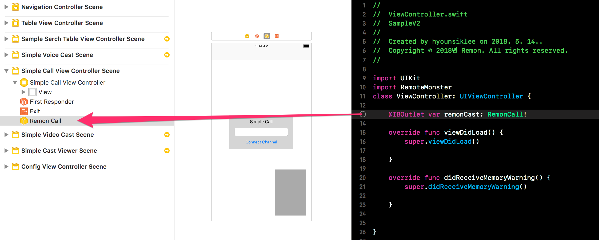

# iOS - Getting Start

## 준비 사항

* Xcode 개발 환경
* iOS 9.2 이상

## 프로젝트 생성 및 설정

Xcode에서 Swift기반의 프로젝트를 생성합니다.

프로젝트 생성 후 `Build Settings`에서 `Enable Bitcode`에 대하여 `No`를 설정해야 합니다.


또한 Info.plist에서 다음 항목에 대해 추가 혹은 변경을 해주셔야 합니다.

* Privacy: Bluetooth, Microphone, Camera


## SDK 설치 - Cocoapods

SDK 설치를 원하는 프로젝트의 `Podfile`에 `pod 'RemoteMonster', '~> 2.0'`을 추가 합니다



```text
target 'MyApp' do
  pod 'RemoteMonster', '~> 2.0'
end
```



. 그리고 터미널에서 `pod install` 를 실행 합니다. 만약 `pod install` 이 동작하지 않는 다면 `pod update`를 실행 합니다.

```bash
$ pod install
```

## SDK 설치 - 직접 import

우선 아래의 링크를 통해 iOS SDK의 마지막 버전을 다운로드 받습니다.



다운로드받은 RemoteMonster iOS SDK를 압축을 풀면 2개의 Framework이 존재합니다. 각각의 Framework을 Finder에서 끌어다 프로젝트 트리창에 놓습니다. 그러면 RemoteMonster SDK를 프레임워크로 인식하게 됩니다.


## Remon 설정 및 레이아웃 구성

`Remon`은 `RemonIBController`를 이용하여 InterfaceBuilder를 이용한 설정이 가능 합니다.

* 스토리보드에 `RemonIBController`의 하위객체인 `RemonCall` 또는 `RemonCast`를 추가합니다.
  * `RemonCall`를 1:1 통신을 지원 하며 `RemonCast`는 1:N 방송을 지원 합니다.
  * InterfaceBuilder에서 `Utilities` 뷰를 이용하여 `Remon`을 설정 합니다.
* `ServiceID`와 `Service Key`를 설정합니다.
  * 만약 간단하게 테스트를 하기 원한다면 아무것도 입력 안해도 됩니다.
  * 실제 서비스를 고려한다면 아래를 참고하여 내가 사용할 키를 발급받으세요.




* 스토리보드에서 원하는 Scene에서 원하는 위치에 `Veiw`를 배치하고 `RemonIBController`의 `remoteView`와 `localView`에 바인딩 하여 줍니다.


* `Remon`를 사용하는 `ViewContoller`에 RemoteMonster SDK를 임포트 하고, `RemonIBController`객체를 아웃렛 변수에 바인딩 합니다.



## 개발

이제 모든 준비가 끝났습니다. 아래를 통해 세부적인 개발 방법을 확인하세요.

### 방송

`RemonCast`로 방송 기능을 쉽고 빠르게 만들 수 있습니다.

#### 방송 송출

```swift
let caster = RemonCast()
caster.create()
```

#### 방송 시청

```swift
let viewer = RemonCast()
viewer.join("CHANNEL_ID")
```

혹은 좀더 자세한 내용은 아래를 참고하세요.



### 통신

`RemonCall`로 통신 기능을 쉽고 빠르게 만들 수 있습니다.

```swift
let remonCall = RemonCall()
remonCall.connect("CHANNEL_ID")            // Communication
```

혹은 좀더 자세한 내용은 아래를 참고하세요.



## Known Caveats

### 오디오 타입

`Remon`에는 voice와 music 2가지의 오디오 타입이 존재 합니다. voice 모드를 기본값으로 동작 하며, 목소리 중심이 아닌 다양 소리을 이용 하기를 원하시면 music모드를 이용 할 수 있습니다. music모드는 특히 방송에 더 잘 어울리는 경향이 있습니다.


`RemonSettings.plist` 파일을 프로젝트에 추가하고, AudioType 값을 원하는 모드로 변경해 주세요.

### Background Mode Support

백그라운드에서 SDK 연결을 지속적으로 필요하면 아래의 옵션을 Project &gt; Targets &gt; Capabilities &gt; Background Modes 에서 설정하면 됩니다. 백그라운드 설정을 안할 경우 앱이 백그라운드로 진입시 RemoteMonster와의 연결이 종료되어 방송 및 통화가 종료됩니다.


백그라운드 모드는 아래를 참고하세요




