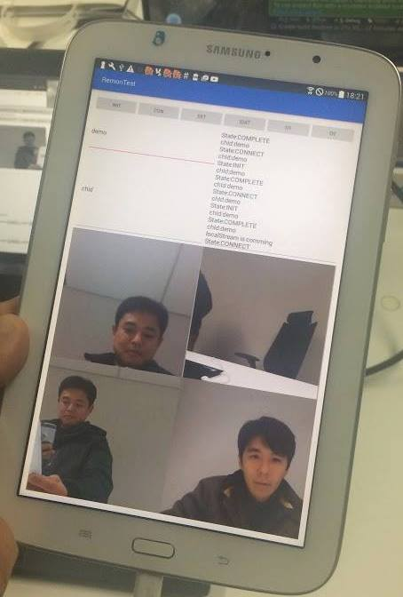

# 리모트몬스터 안드로이드의 레이아웃과 뷰

* 리모트몬스터 안드로이드 SDK는 레이아웃과 관련하여 2개의 클래스를 제공하고 있습니다. 가장 핵심이 되는, 영상을 출력하는 View인 org.webrtc.SurfaceViewRender와 이 SurfaceViewRender를 효율적으로 RelativeLayout에서 배치하는데 도움을 주는 PercentFrameLayout으로 이루어져 있습니다. 이 중에서도 SurfaceViewRender가 가장 핵심이므로 먼저 살펴보겠습니다.

## SurfaceViewRender

* android layout 파일에서 다음과 같이 layout에 배치함으로써 SurfaceViewRender를 사용할 수 있습니다.

  ```markup
  <RelativeLayout
  android:layout_width="match_parent"
  android:layout_height="match_parent"
  android:background="@android:color/darker_gray"
  android:layout_alignParentBottom="false"
  android:layout_weight="2">
    <org.webrtc.SurfaceViewRenderer
      android:id="@+id/remote_video_view"
      android:layout_width="wrap_content"
      android:layout_height="wrap_content" />
    <org.webrtc.SurfaceViewRenderer
      android:id="@+id/local_video_view"
      android:layout_width="wrap_content"
      android:layout_height="wrap_content" />
  </RelativeLayout>
  ```

* 그리고 특정 Activity에서 다음과 같이 이 View의 객체를 얻어옵니다.

  ```java
  SurfaceViewRender localRender =
    (SurfaceViewRenderer) findViewById(R.id.local_video_view);
  SurfaceViewRender remoteRender =
    (SurfaceViewRenderer) findViewById(R.id.remote_video_view);
  ```

* 이제 이 뷰를 사용할 기본 준비가 완료되었습니다.
* Remon 클래스의 객체를 생성하고 생성할 때 Config 객체에 이 두 쌍의 뷰를 설정하면 통신이 시작됨과 함께 이 뷰에 카메라나 원격의 영상 스트림이 출력됩니다.
* 몇가지 이 SurfaceViewRender의 메소드를 살펴보겠습니다.

  ```java
  localRender.setZOrderMediaOverlay(true/false);
  ```

* 뷰간의 ZOrder를 설정할 수 있습니다. 즉 이 뷰를 다른 뷰보다 위 위치하도록 설정합니다. 겹치는 뷰가 있을 경우 다른 뷰는 false로 하고 해당 뷰만 true로 설정해야 합니다.

  ```java
  localRender.setMirror(false);
  ```

* 해당 뷰의 영상을 거울효과를 주어서 좌우가 바뀌는 방식으로 보여줄 수 있습니다.

  ```java
  localRender.setScalingType(RendererCommon.ScalingType);
  ```

* layout에 어떻게 채울지를 결정합니다.

## PercentFrameLayout

* 리모트몬스터 안드로이드 SDK에서는 영상관련 View의 배치를 쉽게 하기 위해 PercentFrameLayout을 제공합니다. PercentFrameLayout을 이용하면 영상 관련 View를 RelativeLayout안에서 자유롭게 배치하고 동적으로 움직일 수 있습니다.
* 다음 화면처럼 여러 SurfaceViewRender를 구성하는 것도 가능합니다.

  

* PercentFrameLayout은 layout내의 뷰들을 퍼센트 방식으로 배치합니다. 즉,

  ```java
  layout.setPosition(0,0,100,100);
  ```

* 은 해당 레이아웃을 relativeLayout상에서 가로세로 100%채워서 배치하겠다는 것이고

  ```java
  layout.setPosition(0,50,50,50);
  ```

* 은 해당 레이아웃을 relativeLayout을 4분면으로 나눠서 좌측 하단에 50%만큼 자리를 차지하겠다는 것입니다.

